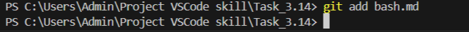

[< к содержанию](./readme.md)

## git add

**git add *[файл]*** - добавлет отдельный файл в область подготовленных файлов.

Чтобы добавить все файлы в каталоге в индекс, используйте следующую команду:

```bash=
git add .
```

Пример добавления отдельного файла:



После добавления файлов, можно проверить изменения, с помощью команды <u>[git status](./status.md)</u>