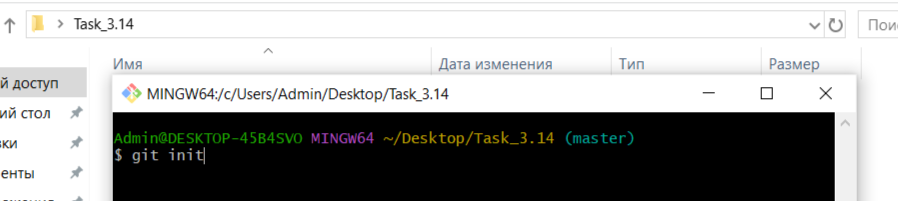

[< к содержанию](./readme.md)

[< к подготовке к работе](./startwork.md)

### GIT bash

Перед началом работ необходимо установить <u>*[GIT bash](https://gitforwindows.org/)*</u> (сылка приведена для ОС Windows).  
Так же должен быть создан аккаунт на <u>*[github](https://github.com)*</u>.

После этого пользователям надо создать новй репозиторий: для этого надо перейти в профиле *github* на вкладку *"Repositories"* и нажать на зеленую кнопку "New" в правом верхнем углу:

Затем пользователем вводится наименование нового репозитория, проставляется необходимая информация о публичности репозитория, сразу можно создать файл *README* и *.gitignore*, после чего можно нажимать на "__*Create repository*__".

Теперь, для того, чтобы начать работать с удаленным репозиторием, необходимо заклонировать его, потому что работать пользователи должны с локальным репозиторием.

Для этого, в созданном репозитории надо нажать на зеленую кнопку __*"Code"*__ и нажать копировать:

После этого на рабочем столе надо нажать правую кнопку мыши и выбрать *"Open GIT Bash Here"*:

Далее прописывается команда <u>[git clone](./clone.md)</u> со скопированной ссылкой:

Работа начинается с инициализации репозитория, т.е. необходимо зайти в полученную после клонирования папку, открыть в ней *GIT Bash* с помощью мыши и ввести первую команду [git init](./init.md):

**Готово!**