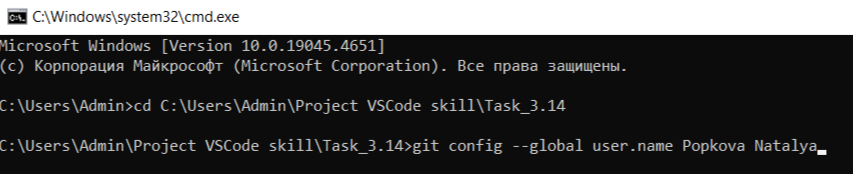

[< к содержанию](./readme.md)

[< к подготовке к работе](./startwork.md)

### Командная строка

Сначала надо создать папку для работы - локальный репозиторий. Так же должен быть создан аккаунт на <u>*[GIT Hab](https://github.com)*</u>.

После этого можно открыть командную строку,   например, в операционной системе Windows это сочетание клавиш <u>*Win+R*</u>. 

После открытия командой строки необходимо выполнить команду: 
```bash=
cmd
```
И нажать *Enter*.

Затем с помощью команды cd перейти в созданную папку и начать с выполнения первой команды <u>*[git config](./config.md)*</u>



**Готово!**