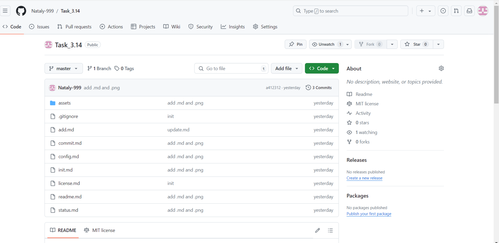

[< к содержанию](./readme.md)

### Заключение ###

После выполнения основных команд можно посмотреть результат работы на <u>*[github](https://github.com)*</u>

Пример результата работы с основными командами:

