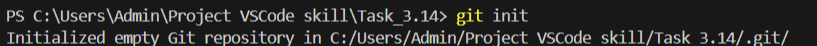

[< к содержанию](./readme.md)

## git init

**git init** - Инициализация репозитория.

Для того чтобы проинициализировать новый репозиторий, необходимо открыть в консоли нужную папку и выполнить команду:

```bash=
git init
```

Пример выполнения команды:

