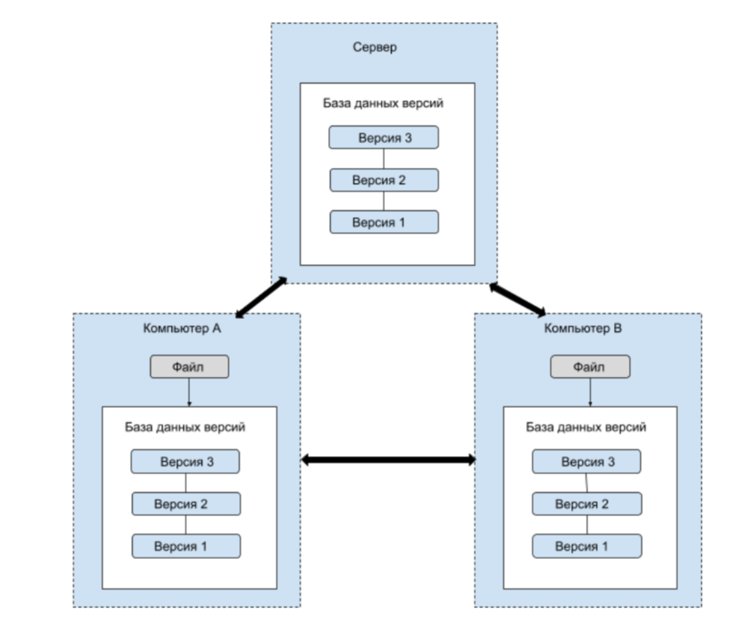

[< к содержанию](./readme.md)
### Введение ###

> <u>**GIT** - распределенная система контроля версий.</u> 

Эта система характерна тем, что при загрузке файлов 
клиентами создает **полную** зеркальную копию репозитория.   

Поэтому в случае выхода из строя одного из серверов его
работоспособность можно восстановить, если скопировать один из клиентских репозиториев, причем каждое копирование сопровождается полным резервным копированием всех данных.

Основное отличие Git от других систем контроля версий состоит в том, что он воспринимает данные как набор снимков состояний файловой системы.
При создании новой версии делается снимок всех файлов в конкретный момент времени и сохраняется ссылка на этот снимок. А для файлов, которые не были изменены, сохраняется ссылка на их ранее сохраненные версии.
