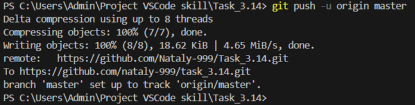

[< к содержанию](./readme.md) 

## git push

**git push** - команда для отправки всех изменений на сервер (в удаленный репозиторий).

 Выполняется следующим образом:
```bash=
git push
```
Если необходимо внести изменения в определенную ветку репозитория то надо выполнит команду: 
```bash=
git push orign master
```
где <u>*orign*</u> - название репозитория, <u>*master*</u> - название ветки

Пример результата выполнения команды: 


