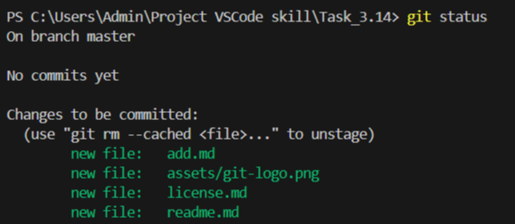

[< к содержанию](./readme.md) 

## git status

**git status** - Проверка состояния

Команда служит для проверки подготовленности файлов к коммиту. 

```bash=
git status
```

Пример результата выполнения команды: 



Выполняя эту команду, можно отслеживать состояния файлов и, если не все файлы добавлены, то выполнить команду: <u>[git add](./add.md)</u>