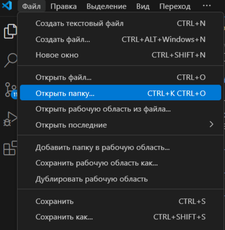
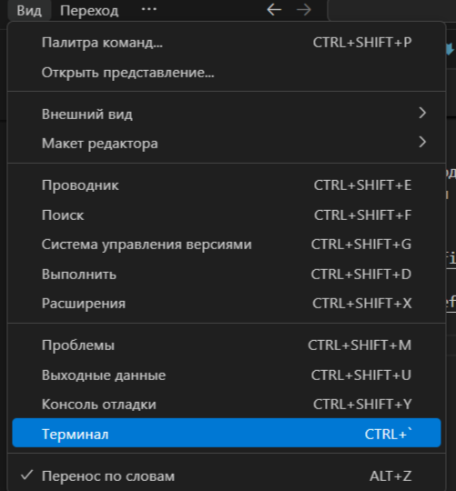
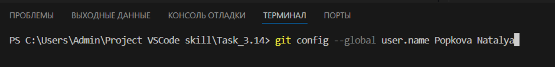

[< к содержанию](./readme.md)

[< к подготовке к работе](./startwork.md)

### VSCode

Перед началом работ необходимо установить <u>*[VSCode](https://code.visualstudio.com/)*</u>.
Так же должен быть создан аккаунт на <u>*[GIT Hab](https://github.com)*</u>.

После установки *VSCode* необходимо открыть его, нажать на *"Файл"* -> *"Открыть папку"* и выбрать папку (локальный репозиторий):

После этого для выполнения команд необходимо нажать кнопку *"Вид"*, открыть *"Терминал"*:

Внизу появится окно с адресом папки *(локального репозитория)*. Можно начинать ввод команд:

**Готово!**